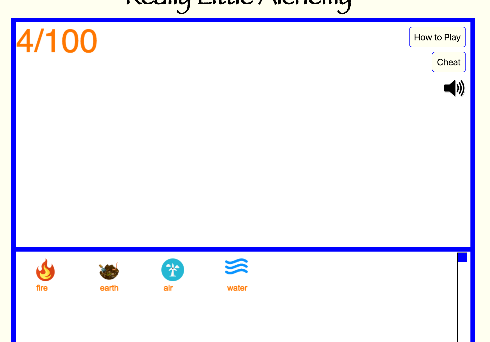
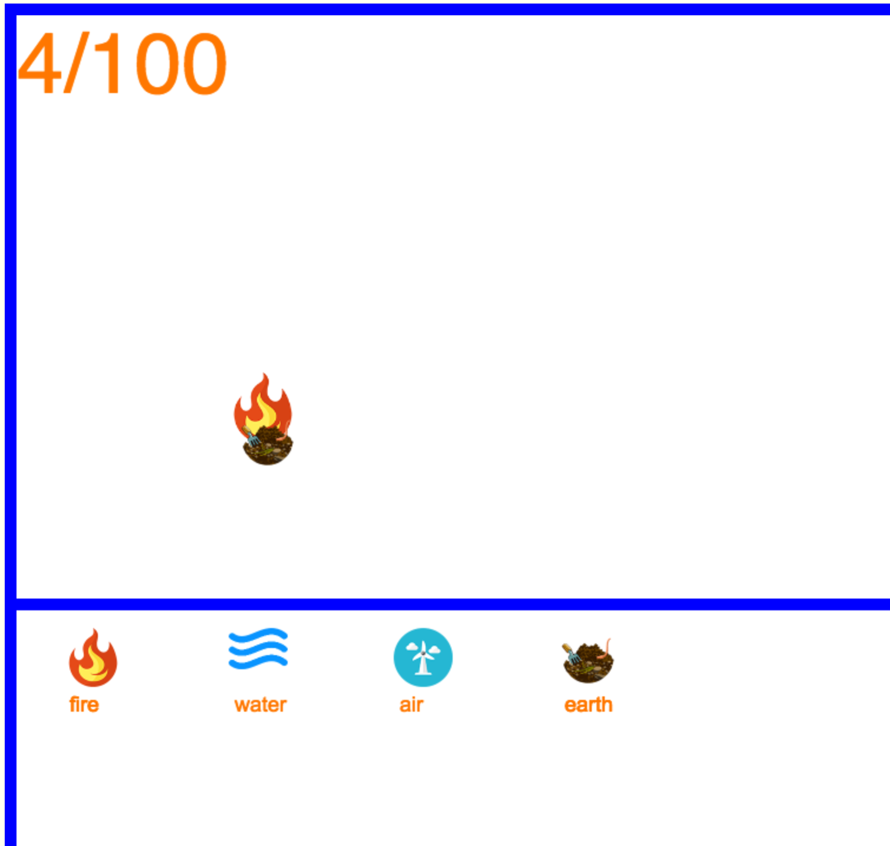
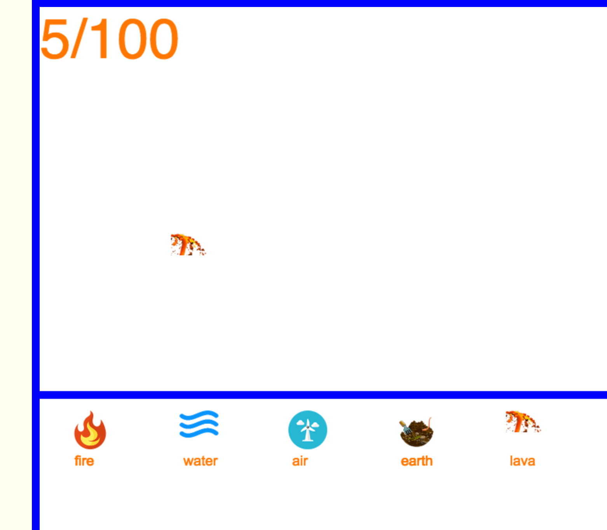
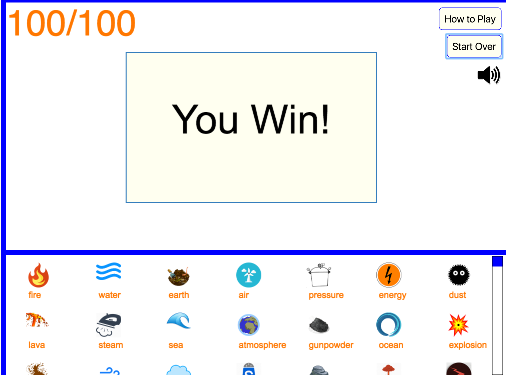
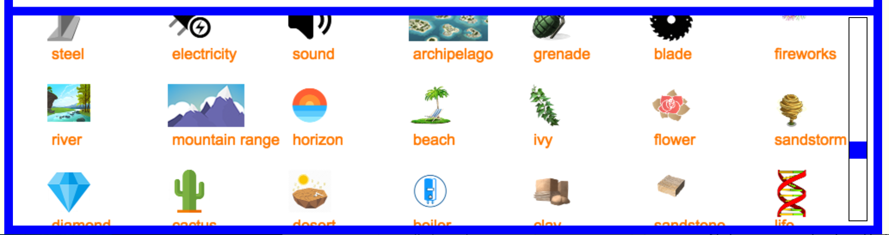

## Really Little Alchemy

Really Little Alchemy is a game where users combine simple items to create up to 100 increasingly complex items.

[Really Little Alchemy Live][url]
[url]: https://michaeljstevens.github.io/really_little_alchemy/

### Background

Alchemy is a game where a player begins with basic items which can be combined in logical ways to discover new items. For example, earth and fire become lava, water and fire become steam, etc. The goal of the game is to unlock all the possible elements.

This project is a streamlined JavaScript implementation of Alchemy, as described below.

### Features

- 100 items to discover
- Drag and drop interface
- Custom scrollbar
- Sound effects

### Architecture and Technologies

- JavaScript
- CreateJS
- jQuery
- CSS3/HTML5

### How to Play

You're given 4 items to start: fire, water, earth, and air.



Drag and drop items from the smaller compartment to the larger compartment. Drag two items together to see if they combine.



If two items are compatible, a new item will become available.



Try to find as many items as you can.


Upon discovering the 100th item, a win modal pops up.



Click the sound icon to mute the sound effects.


Drag and drop the scrollbar to view all discovered items.



### Code Snippets

To handle overlapping items I simply checked if their coordinates overlapped to within 30px.

```js
if (this !== element && !(element.x - 15 > this.x + 15 ||
                          element.x + 15 < this.x - 15 ||
                          element.y - 15 > this.y + 15 ||
                          element.y + 15 < this.y - 15))
```
Creating the vertical scrollbar presented a challenge. First, a created the scrollbar in html and used the jQuery ui library to set a draggable listener to the DOM element. 'stage.children[1]' is a container with all discovered items. I adjusted the 'ui.position.top' to accommodate all 100 items.

```js
  $(".bar").draggable({
    containment: "parent"
  });

  $(".bar").on("drag", function (event, ui) {
    stage.children[1].y = 0 - ui.position.top * 5.8;
    stage.update();
  });
```
I then had to add a mask using CreateJS to 'stage.children[1]' to prevent items from overlapping into the main compartment.

```js
  var mask = new createjs.Shape();
  mask.graphics.f("#f00").dr(0,505,1000,500);
  disContainer.mask = mask;
```
However, this created a problem in that I was no longer able to drag items from the bottom to the top. To solve this problem, I modified the CreateJS click listener to clone the item and add it to the top container.

```js
  bitmap.on("mousedown", function (evt) {
    if(evt.currentTarget.y > 465 ) {
      stage.children[2].addChild(bitmap);
      let bitmapDup = bitmap.clone(true);
      var imageDup = new Image();
      imageDup.src = this.image.src;
      imageDup.onload = handleImageLoad.bind(bitmapDup);

      this.y = evt.stageY - 20;
      this.offset = {x: this.x - evt.stageX, y: this.y - evt.stageY};
    } else {
      this.offset = {x: this.x - evt.stageX, y: this.y - evt.stageY};
    }
  });
```

```js
  var allRecipes = require('./combos.js');

  function combine(el1, el2) {
      let recipe = [el1, el2].sort().join(',');
      return allRecipes[recipe];
  }

  module.exports = combine;
```

To combine the items into newly discovered items, I created an array of the possible combinations and created a function to output a new item based on two inputted items.

```js
  var allRecipes = recipes.reduce((comb, [first, second]) => {
    if (!comb.hasOwnProperty(second)) comb[second] = [];
    comb[second].push(first);
    return comb;
  }, {});
```


### Future Direction

I plan to add the following features to this application:

- More elements
- Unique sound effect for each discovery
- Save and load game
